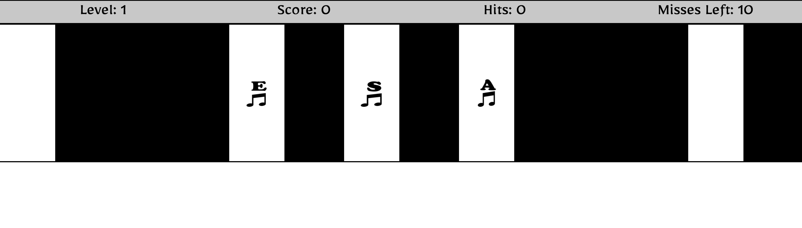

# Piano Tiles

    Piano Tiles is a simple game where you need to press the white music keys with the corresponding 'Key' that shows up on the tile. If you press the key before the key 
    disappears, you get a 'hit' and score 5 points. When you hit 20 times and score 100 points without missing 10 keys, you win. But, if you miss more than left, shown 'Misses Left' on the scoreboard, then you lose. 

## Technologies Used
    1. HTML5
    2. CSS3
    3. JS
    4. jQuery
    5. [MotionDetector JS Library](https://github.com/beije/motion-detection-in-javascript)

## Unsolved Problem
    1. Loser is not yet functioning. You lose when you miss more than 10 keys. 'Misses Left'    
        becomes 0 or less.
    2. The motion detection game is experimental & incomplete, so when you start the game, disable 
        video camera when prompted.

## How to Play?
    1. Press 'Enter' to start the game.
    2. Press the correspoding key of the white tiles with music icon.
        If you press the right key, the tile will turn green.
    3. Each correct pressing the key has 5 points added to score.
    4. Score of 100 or 20 hits, you win.
    5. Miss more than 10 keys, you lose. 

#NOTE: When prompted, disable your camera.
